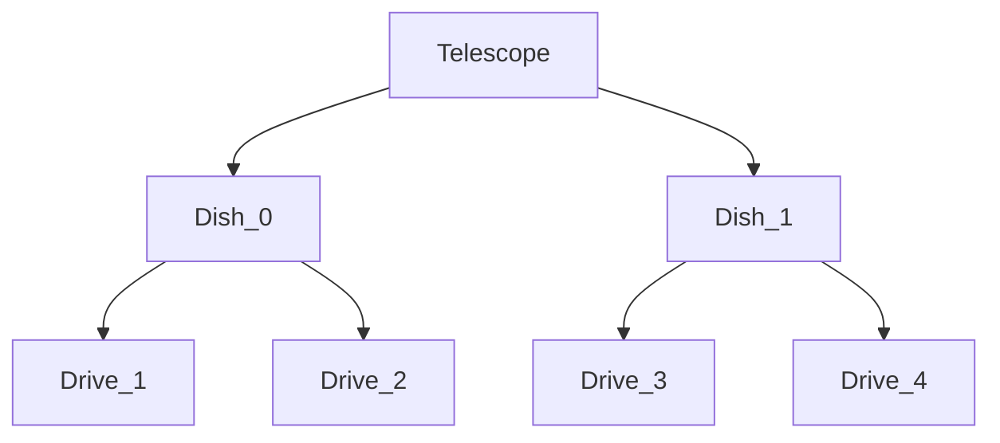

# RIF control
Written by Vela Gateshka

## About 
This is the documentation for the python module that can be used to control the Ulrich J. Schwarz Radio interferometer (RIF). 

### Features:
- Temperature visualization
- Virtual Telescope for testing


# Contents
- [CANbus reference](#canbus-reference)
- [Classes](#classes)


## Overview

### Node ID's
- Western dish: 
    - Telescope ID: 0
    - Drives: RA &rarr; 1 DEC &rarr; 2 
    - Cooling: 5
- Eastern dish: 
    - Telescope ID: 1
    - Drives: RA &rarr; 3 DEC &rarr; 4 
    - Cooling: 6

### Chart



## CANbus reference


## Classes
- [Telescope](#telescope)

### Telescope

```python
class Telescope(telescope_type="real", bitrate: int = 500000, can_bus_manager= None)
```

The class that manages the highest level functions.

<div style="background-color: #294a70;">
<b> Parameters: </b>

</div>

- **telescope_type:** *str*
    - "virtual" or "real"
- **bitrate:** *int*
    - bitrate of can connection
- **can_bus_manager:** *CANBusManager*
    - distributes CAN bus messages to the appropriate handler

<div style="background-color: #294a70;">
<b> Attributes: </b>

</div>

- **observing_location:** *EarthLocation* = EarthLocation(lat='51.816694', lon='5.866694', height=20*u.m)
    - location of telescope
- **revolutions_to_increments:** *int* = 65536
    - number of increments per revolution
- **virtual:** *bool* = False
    - flag to determine if the telescope is virtual
- **request_queue:** 
    - request queue on the telescope level
- **dish_west:** *Dish* = Dish(0, self.can_bus_manager)
- **dish_east:** *Dish* = Dish(1, self.can_bus_manager)
- **dishes:** = [self.dish_east, self.dish_west]
- **dishes_in_position:** *int* = 0
    - number of dishes that have reached their target
- **state:** *ComponentState* = ComponentState.IDLE
    - current state of the telescope
- **running:** *bool* = False
- **process_thread:** = None
- **receiver:** *Receiver*

<div style="background-color: #294a70;">
<b> Methods: </b>

</div>

| Method | Summary |
| --- | --- |
| **start**(skip_init=False)|  hey |
| **add_task**(action, *args, callback) |  - |
| **move_to**(coord:SkyCoord, pos=None) | - |
| **add_survey**(survey, point_duration=30*60) | Add survey to queue |
| **wait**(wait_time) | - |
| **get_queue_length**() | Get the number of pending requests |
| **is_busy**() | Check if the telescope state machine is busy |
 
        

### Dish

