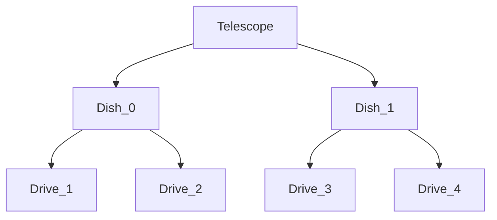

# RIF control
Written by Vela Gateshka

## About 
This is the documentation for the python module that can be used to control the Ulrich J. Schwarz Radio interferometer (RIF). 

### Features:
- Temperature visualization
- Virtual Telescope for testing


# Contents
- [CANbus reference](#canbus-reference)
- [Classes](#classes)


## Overview

### Node ID's
- Western dish: 
    - Telescope ID: 0
    - Drives: RA &rarr; 1 DEC &rarr; 2 
    - Cooling: 5
- Eastern dish: 
    - Telescope ID: 1
    - Drives: RA &rarr; 3 DEC &rarr; 4 
    - Cooling: 6

### Chart



## CANbus reference


## Classes
- [Telescope](#telescope)

### Telescope

```python
class Telescope(telescope_type="real", bitrate: int = 500000, can_bus_manager= None)
```

The class that manages the highest level functions.

<div style="background-color: #cfc8c2;">
<b>Parameters</b>
</div>